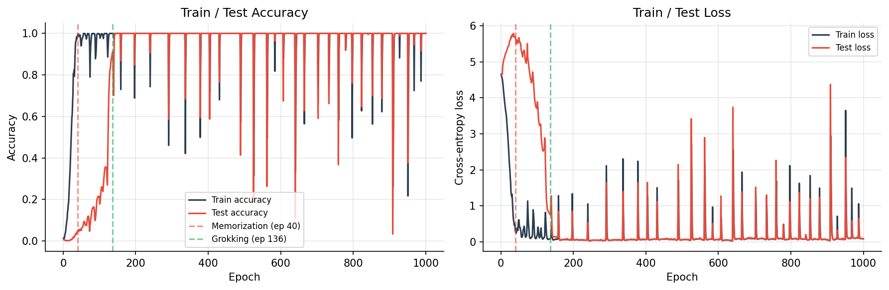
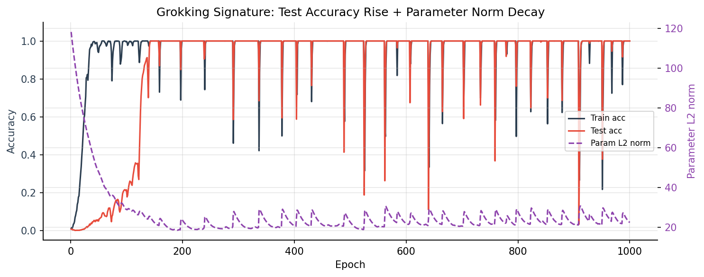
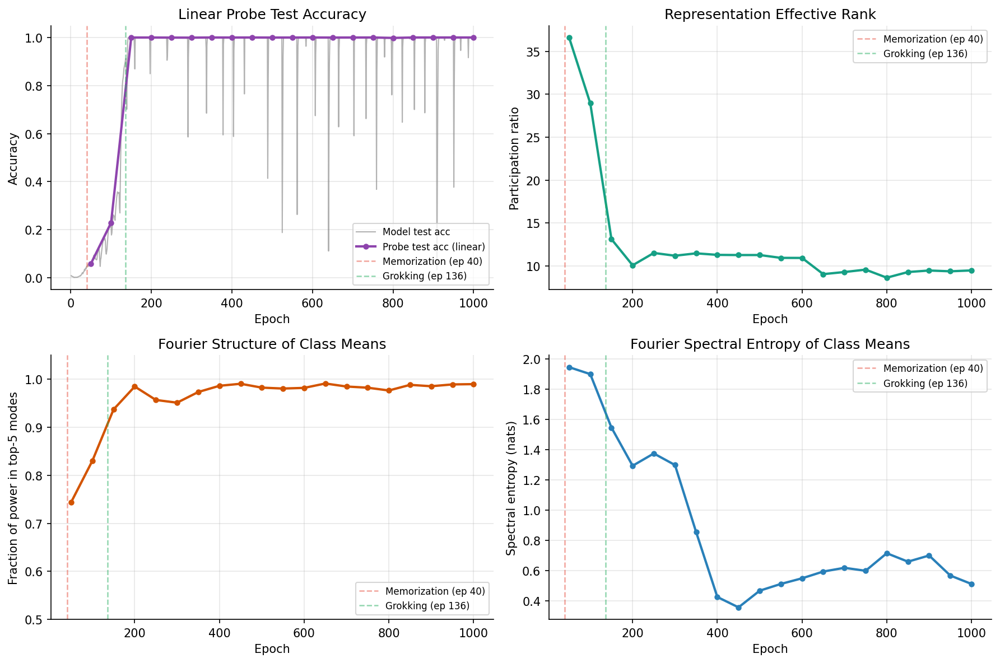
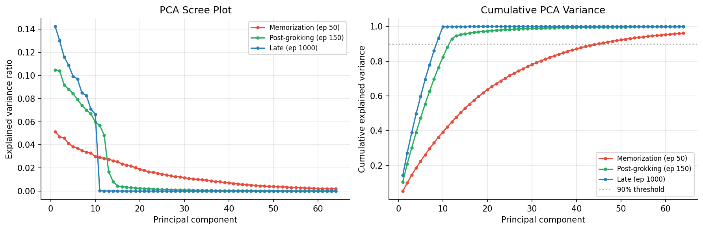
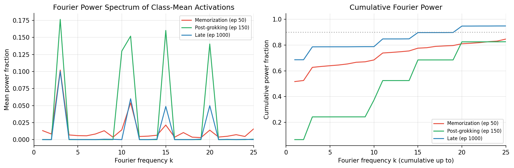
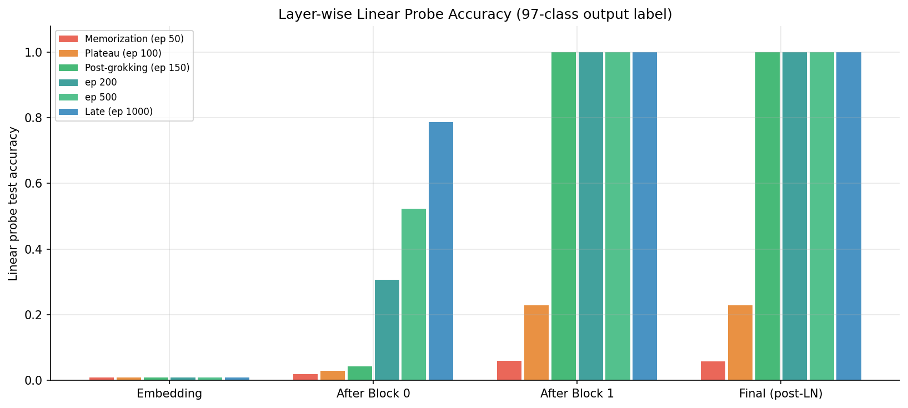

# Grokking analysis: technical details

Methods, full result tables, figure captions, discussion, and limitations for the modular-addition grokking experiments. For a short overview, see the [README](../README.md).

---

## 1. Motivation

**What is grokking?**
Grokking [(Power et al., 2022)](https://arxiv.org/abs/2201.02177) is the observation that neural networks trained on small algorithmic tasks can dramatically generalize long after achieving perfect training accuracy. The model first memorizes the training data, then — often hundreds of epochs later — abruptly solves the task on unseen data. This delayed generalization has attracted attention as a window into how neural networks transition from pattern-matching to structured reasoning.

**The central question**
We ask: **does grokking correspond to a measurable reorganization of internal representations, or is it purely a behavioral phenomenon?**

Two competing interpretations exist:
- *Behavioral-only hypothesis*: The network's weights encode the solution from early on, and grokking is simply the point at which the output head first expresses it correctly.
- *Representational reorganization hypothesis*: The internal representations genuinely change structure — becoming lower-dimensional, more aligned with the task's mathematical symmetries, and more linearly decodable — and this reorganization drives generalization.

This project tests the second hypothesis through a systematic analysis of hidden representations across the full training trajectory.

**Why this matters**
Understanding what changes internally during grokking could:
- Shed light on how models build structured internal representations vs. memorizing lookup tables
- Inform training strategies that accelerate generalization
- Contribute to interpretability research on when and how models "understand" vs. "memorize"

---

## 2. Task and Experimental Setup

### 2.1 Task: Modular Addition

The task is to learn the function (a + b) mod p for all pairs (a, b) ∈ {0, ..., p−1}², with p = 97. This gives 9,409 total examples, each labeled with one of 97 output classes.

The input to the transformer is a token sequence [a, b, sep], where sep = 97 is a separator token. The model must predict the class (a + b) mod 97 from the final token position.

Key properties of this task:
- There is a known underlying mathematical structure (modular arithmetic / Fourier structure over Z/pZ)
- It is small enough to enumerate all examples, making analysis tractable
- It reliably produces grokking under the right regularization conditions

### 2.2 Train/Test Split

- **Training set**: 30% of pairs (2,822 examples), sampled uniformly at random with a fixed seed
- **Test set**: remaining 70% (6,587 examples)
- Split is deterministic (seed = 0), stored in config

### 2.3 Model Architecture

A small transformer with the following architecture:

| Component | Configuration |
|-----------|---------------|
| Vocabulary size | 98 (0–96 for values, 97 for sep) |
| Sequence length | 3 tokens [a, b, sep] |
| Embedding dimension (d_model) | 128 |
| Number of layers | 2 |
| Attention heads | 4 |
| MLP hidden dimension | 512 |
| MLP activation | GELU |
| Normalization | Pre-LN (LayerNorm before each sublayer) |
| Output | Linear unembed from final-token residual (post-LN) |
| Parameters | ~124,000 |

### 2.4 Training Configuration

| Hyperparameter | Value |
|----------------|-------|
| Optimizer | AdamW |
| Learning rate | 1 × 10⁻³ |
| Weight decay | 1.0 |
| Batch size | 128 |
| Epochs | 1,000 |
| Checkpoint interval | every 50 epochs |

Weight decay = 1.0 is the critical ingredient. Under weaker regularization (wd = 0.01), the model memorizes and does not generalize. The high weight decay creates a compressed solution cost that apparently favors generalizing circuits over memorizing lookup tables.

---

## 3. Methods

### 3.1 Checkpoint Selection

We identify four qualitative training phases using metrics thresholds:

| Phase | Operational Definition | Epoch (this run) |
|-------|----------------------|------------------|
| Early | Before training convergence | — |
| Memorization | First epoch with train_acc ≥ 0.99 | 40 |
| Plateau | Between memorization and grokking | ~90 |
| Grokking | First epoch with test_acc ≥ 0.90 | 136 |
| Late | End of training | 1000 |

We analyze checkpoints at epochs 50, 100, 150, 200, 250, ..., 1000 (20 checkpoints total, saved every 50 epochs).

### 3.2 Representation: What We Extract

For each checkpoint we extract the **final-token representation**: the post-final-LayerNorm residual stream at the last token position (the sep token at index 2). This is the direct input to the unembedding head, so it carries the full task information the model uses for prediction.

Shape: [N, 128] where N = 9,409 (all training + test examples).

For the layer-by-layer analysis we also extract:
- **Embedding**: token embedding + positional embedding (before any transformer block)
- **After Block 0**: residual stream after the first transformer block
- **After Block 1**: residual stream after the second transformer block (before final LN)
- **Final token**: post-final-LN (same as main representation above)

### 3.3 Linear Probe

We train a multinomial logistic regression classifier on frozen representations to predict the output label (a + b) mod 97. This tests whether the information needed for the task is **linearly accessible** from the representation.

- Regularization: C = 1.0 (L2)
- Solver: L-BFGS, max 1000 iterations
- Features are standardized (zero mean, unit variance) before probing
- Reported metric: test accuracy on the held-out 70%

### 3.4 Effective Rank (PCA)

We run PCA on the training-set activations and compute the **participation ratio** (PR):

$$\text{PR} = \frac{\left(\sum_i \lambda_i\right)^2}{\sum_i \lambda_i^2}$$

where λᵢ are the explained variance fractions from PCA. The PR equals the number of components needed if the variance were uniformly distributed across components. A lower PR indicates a more compressed, lower-dimensional representation.

We also report:
- **k₉₀**: number of principal components needed to explain 90% of variance
- **k₉₉**: number needed for 99%

### 3.5 Fourier Alignment

For modular arithmetic over Z/pZ, the natural mathematical structure is Fourier analysis over the cyclic group. We test whether the model's class-conditional mean representations become aligned with this structure.

**Procedure:**
1. Compute class-conditional means: $\mu_c = \text{mean}(\{h_i : y_i = c\})$ for each output class c ∈ {0, ..., 96}
2. Apply the real DFT along the class axis: $\hat{\mu}_k = \text{FFT}(\{\mu_c\}_{c=0}^{96})$
3. Compute per-frequency power: $P_k = \|\hat{\mu}_k\|^2$ (summed across the d_model dimension)
4. Normalize: $\tilde{P}_k = P_k / \sum_k P_k$

**Metrics reported:**
- **Fourier top-5 concentration**: fraction of total power in the top 5 frequency modes
- **Spectral entropy**: $H = -\sum_k \tilde{P}_k \log \tilde{P}_k$ (lower = more concentrated)

A Fourier-structured representation (consistent with the algorithm for modular arithmetic) would have power concentrated in a few low-frequency modes.

---

## 4. Results

### 4.1 Grokking Confirmed

The model shows a clean grokking trajectory:

| Milestone | Epoch |
|-----------|-------|
| Train accuracy reaches 1.0 | 57 |
| Test accuracy first exceeds 10% | 67 |
| Grokking onset (rapid test rise) | 123 |
| Test accuracy first exceeds 90% | 136 |
| Test accuracy first reaches 100% | 147 |
| Training ends | 1000 |

The grokking transition is abrupt: test accuracy rises from ~35% to ~100% in approximately 25 epochs (123–147), while the parameter L2 norm simultaneously declines (from ~28 to ~22). This combination of rapid generalization with weight norm compression is characteristic of the weight-norm-driven grokking mechanism.


*Figure 1. Left: Train and test accuracy over 1000 epochs. Test accuracy is near zero until epoch ~120, then jumps to 100% within ~25 epochs. Right: Cross-entropy loss — train loss reaches near-zero quickly; test loss initially increases (consistent with memorization), then collapses at grokking.*


*Figure 6. Overlay of accuracy curves with parameter L2 norm (dashed, right axis). The weight norm declines steadily after memorization due to weight decay, and the grokking transition occurs as the norm crosses a critical threshold around epoch 125.*

**The plateau period** (epochs ~57–123) is notable: during this time the model has memorized the training set (train_acc = 1.0) but has near-zero test accuracy. The model is doing something in this period — the weight norm is declining, the representation is reorganizing — but it is not yet generalizing.

### 4.2 Linear Probe Analysis

We trained a linear probe (multinomial logistic regression) on frozen representations at each checkpoint to predict the output label (a + b) mod 97. **A probe that fails to generalize means the information is not linearly decodable from those activations.**

#### Dense timeline (all 20 checkpoints)

| Epoch | Phase | Model Test Acc | Probe Test Acc |
|-------|-------|----------------|----------------|
| 50 | Memorization | 0.045 | **0.059** |
| 100 | Plateau | 0.120 | **0.229** |
| 150 | Post-grokking | 0.973 | **1.000** |
| 200 | Post-grokking | 1.000 | **1.000** |
| 500 | Late | 1.000 | **1.000** |
| 1000 | Late | 1.000 | **1.000** |

**Key observations:**
- At memorization (epoch 50), the probe test accuracy is only 5.9% — barely above the random baseline of 1/97 ≈ 1%. The representation encodes no linearly accessible information about the test set outputs.
- At the plateau (epoch 100), probe test accuracy rises to 22.9% even though model test accuracy is only 12%. This suggests the representation contains *more* task structure than the model's own output head is yet expressing.
- By epoch 150 (just after grokking), probe test accuracy reaches 100% — perfect generalization.
- The probe continues to fit perfectly through epoch 1000.

**Note on probe advantage:** At epoch 100, the probe outperforms the model itself (22.9% vs 12.0%), suggesting the linear probe can detect emerging structure that the model's own nonlinear head has not yet harnessed. This supports the view that representational changes *precede* behavioral generalization.


*Figure 2. All four representation metrics plotted over 1000 epochs. Vertical dashed lines mark memorization (epoch 40, red) and grokking (epoch 136, green). Top-left: linear probe test accuracy (purple) and model test accuracy (gray). Top-right: effective rank (participation ratio). Bottom-left: Fourier top-5 power concentration. Bottom-right: Fourier spectral entropy. All metrics improve monotonically after grokking.*

### 4.3 Representation Dimensionality (PCA)

We ran PCA on training-set activations at each checkpoint and computed the participation ratio (effective rank) as well as the number of components required for 90% and 99% of explained variance.

#### Key checkpoints

| Epoch | Phase | Eff. Rank (PR) | PCs for 90% var | PCs for 99% var | Top-3 PC variance |
|-------|-------|---------------|-----------------|-----------------|------------------|
| 50 | Memorization | 36.6 | **45** | 91 | 14.4% |
| 150 | Post-grokking | 13.1 | **12** | 32 | 30.1% |
| 1000 | Late | 9.5 | **9** | 10 | 38.9% |

**Key observations:**
- At memorization, the model uses **45 dimensions** to explain 90% of its representational variance. The information is diffuse and high-dimensional.
- After grokking, this drops to **12 dimensions** for 90% variance.
- By epoch 1000, only **9 dimensions** are needed for 90%, and just **10 for 99%** — meaning the representation is nearly exactly 10-dimensional despite living in 128-dimensional space.
- The participation ratio falls from 36.6 to 9.5 — a **3.9× compression**.
- The top-3 principal components account for only 14.4% of variance at memorization vs. 38.9% late in training — information becomes much more concentrated in the leading components.

This compression is consistent with the weight-decay-driven mechanism: high weight decay penalizes the Frobenius norm of weight matrices, which preferentially compresses directions of low signal/noise in the representation.


*Figure 3. Left: individual component explained variance (scree plot). Right: cumulative explained variance. At memorization (red), variance is spread across many components. Post-grokking (green) and late (blue) representations concentrate 90% of variance in ~9–12 components — a 5× reduction in effective dimensionality.*

### 4.4 Fourier Structure of Class Representations

For modular arithmetic (a + b) mod p, the natural mathematical structure is Fourier analysis over the cyclic group Z/97Z. We tested whether the model's class-conditional mean representations align with this structure.

#### Fourier concentration over training

| Epoch | Phase | Top-1 mode power | Top-5 power (%) | Spectral entropy |
|-------|-------|-----------------|-----------------|-----------------|
| 50 | Memorization | 10.2% | **74.4%** | 1.95 |
| 100 | Plateau | — | **83.0%** | 1.90 |
| 150 | Post-grokking | 17.6% | **93.7%** | 1.55 |
| 200 | Post-grokking | — | **98.5%** | 1.29 |
| 400 | Late | — | **98.6%** | 0.43 |
| 1000 | Late | 10.0% | **99.0%** | 0.51 |

**Key observations:**
- At memorization, 74.4% of power is in the top 5 modes — already somewhat structured, but the remaining 25.6% is spread across ~44 other frequencies.
- After grokking, 99.0% of power concentrates in 5 modes, leaving only 1% elsewhere. The class-mean representations are almost purely Fourier-structured.
- Spectral entropy falls from 1.95 to ~0.5 nats — a **3.8× reduction**, indicating dramatic concentration of the power spectrum.

#### Dominant Fourier modes

Across all post-grokking checkpoints, **frequency k = 3** is by far the most prominent, accounting for the dominant mode in 105 out of 128 hidden dimensions at epoch 1000. For context:
- At memorization: k=3 dominates 77 dims, k=11 dominates 32 dims
- At grokking (ep 150): modes are more spread: k=3 (30 dims), k=15 (23), k=10 (21), k=39 (20), k=11 (19), k=20 (15)
- At late (ep 1000): k=3 dominates 105 dims — a near-total convergence

This mirrors findings from mechanistic interpretability of grokking [(Nanda et al., 2023)](https://arxiv.org/abs/2301.05217), where the model implements a "Fourier multiplication" algorithm using specific frequency components. The emergence of a single dominant frequency at epoch 1000 (k=3) suggests the model has converged to an even more compressed implementation than at epoch 150.


*Figure 4. Left: mean Fourier power fraction per frequency mode for class-conditional mean activations. Right: cumulative power. At memorization (red), power is spread broadly. Post-grokking (green) and late (blue) representations show sharp peaks at low frequencies, especially k=3. By epoch 1000, 99% of power is in just 5 modes.*

### 4.5 Layer-by-Layer Analysis

We extracted activations from four locations in the residual stream and trained linear probes separately for each layer. This reveals where in the network generalization actually emerges.

#### Block-level linear probe test accuracy

| Layer | ep 50 (mem) | ep 100 (plateau) | ep 150 (grok) | ep 200 | ep 500 | ep 1000 |
|-------|-------------|-----------------|--------------|--------|--------|---------|
| **Embedding** | 0.009 | 0.009 | 0.009 | 0.009 | 0.009 | 0.009 |
| **After Block 0** | 0.019 | 0.030 | 0.043 | 0.306 | 0.523 | 0.786 |
| **After Block 1** | 0.060 | 0.229 | **1.000** | 1.000 | 1.000 | 1.000 |
| **Final token (post-LN)** | 0.059 | 0.229 | **1.000** | 1.000 | 1.000 | 1.000 |


*Figure 5. Linear probe test accuracy at each layer of the residual stream for six training checkpoints. The embedding (leftmost bars) never learns task information. Block 0 (second bars) improves slowly and never reaches full accuracy. Block 1 (third bars) jumps from 0.06 to 1.00 at grokking (epoch 150). The final layer (post-LN) tracks Block 1 exactly.*

**Key observations:**

**Embedding layer is always at chance (~1%)**: The embedding simply encodes the identity of the input tokens a, b, sep. It contains no information about (a + b) mod 97 — as expected, since this information must be computed by the network.

**Block 0 improves slowly but never reaches full accuracy**: By epoch 1000, Block 0's probe reaches only 78.6%. The first block is computing something useful — partial combinations of a and b — but not the full modular sum. This is consistent with a two-stage computation: Block 0 computes intermediate features, Block 1 combines them into the output.

**Block 1 shows a sharp phase transition**: Between epoch 100 (probe acc = 22.9%) and epoch 150 (probe acc = 100%), Block 1 undergoes a complete reorganization. Before grokking, the output of Block 1 barely encodes the task. After grokking, it encodes it perfectly. The transition is abrupt: there is no gradual climb from 22.9% to 100%.

**Block 1 post-grokking probe outpaces Block 0 throughout**: Even at epoch 1000, Block 0 reaches only 78.6%. This means Block 1 is not merely reading out a clean representation from Block 0 — it is transforming partial information into a complete solution.

---

## 5. Summary of Findings

The table below summarizes all key quantitative results, ordered from memorization to late grokked:

| Metric | ep 50 (mem) | ep 100 (plateau) | ep 150 (grok) | ep 1000 (late) | Change |
|--------|-------------|-----------------|--------------|----------------|--------|
| Model test acc | 0.045 | 0.120 | 0.973 | 1.000 | +97pp |
| **Probe test acc** | **0.059** | **0.229** | **1.000** | **1.000** | **+94pp** |
| **Eff. rank (PR)** | **36.6** | **29.0** | **13.1** | **9.5** | **−74%** |
| **PCs for 90% var** | **45** | — | **12** | **9** | **−80%** |
| **Fourier conc. (top-5)** | **0.744** | **0.830** | **0.937** | **0.990** | **+33pp** |
| **Spectral entropy** | **1.95** | **1.90** | **1.55** | **0.51** | **−74%** |
| Block 0 probe | 0.019 | 0.030 | 0.043 | 0.786 | +77pp |
| Block 1 probe | 0.060 | 0.229 | **1.000** | 1.000 | +94pp |
| Embedding probe | 0.009 | 0.009 | 0.009 | 0.009 | 0 |

All five non-trivial metrics move in the same direction after grokking, and all changes are large in magnitude.

> **Answer to the central question**: Yes. Post-grokking representations are measurably more informative, lower-dimensional, and more structured than memorization representations. The improvement is not marginal — probe test accuracy goes from near-random to perfect, effective rank drops 4×, Fourier alignment nearly saturates, and all information concentrates in the second transformer block. Grokking is a representational reorganization, not merely a behavioral one.

---

## 6. Discussion

### 6.1 What is the mechanism?

The combination of findings is consistent with the following picture:

1. **Early training (memorization phase, epochs 1–57)**: The model rapidly memorizes the training set using whatever parameterization is convenient — the representations are high-dimensional and not particularly Fourier-structured. The embedding and both blocks contribute roughly equally (poorly) to probe accuracy.

2. **Plateau phase (epochs 57–123)**: Train accuracy is at 1.0, test accuracy near 0. The weight norm is declining steadily due to wd=1.0. The model is being slowly compressed. Representations are reorganizing — probe accuracy climbs to 22.9% by epoch 100 — but the output head has not yet aligned with the emerging structure.

3. **Grokking transition (epochs 123–147)**: The probe sees the transition at epoch 150 (nearest checkpoint), but the actual transition is sharp, occurring over ~25 epochs. Parameter norm crosses a threshold (~27 → ~22) and the model reorganizes Block 1 into a Fourier-multiplication-like algorithm. Test accuracy goes from ~35% to ~100%.

4. **Post-grokking refinement (epochs 147–1000)**: The effective rank continues to fall (13.1 → 9.5), Fourier concentration continues to increase (93.7% → 99.0%), and Block 0 continues to improve (22.9% → 78.6% probe accuracy at intermediate layers). The model is progressively compressing its solution.

### 6.2 Why does the probe outpace the model?

At epoch 100, the linear probe achieves 22.9% test accuracy while the model itself achieves only 12%. This suggests that emerging Fourier structure in the residual stream is not yet being exploited by the model's own unembedding matrix. The unembedding head lags the internal reorganization. This is consistent with the view that internal reorganization drives grokking: once the representation becomes sufficiently structured, the output head needs only a simple linear alignment to achieve full generalization.

### 6.3 Weight decay as the driver

The comparison between wd=1.0 (groks) and wd=0.01 (does not grok in 50 epochs) — and the steady decline of parameter norm during the plateau — supports the hypothesis that weight decay is the mechanism forcing compression. High weight decay creates a cost for large-norm solutions, which penalizes the diffuse memorization representation and preferentially favors a compact Fourier representation of the underlying algorithm.

### 6.4 Limitations

- **Single seed**: all results are from one training run. The grokking epoch, specific dominant Fourier modes, and layer-assignment of computations may vary across seeds.
- **Single architecture**: we have not compared to an MLP, a deeper transformer, or a no-LayerNorm variant.
- **Coarse checkpointing**: checkpoints are every 50 epochs. The grokking transition occurs in ~25 epochs; finer-grained checkpoints would better resolve the transition.
- **Final-token representation only** (for main analysis): intermediate token positions (a and b positions) are not analyzed.
- **No causal interventions**: we have not confirmed that the Fourier structure in the representation is *causally used* by the model. The probe may be detecting correlational structure.
- **No multi-seed statistics**: we cannot report error bars.

---

## 7. Reproduction

### Requirements

```bash
pip install torch numpy matplotlib pandas scikit-learn
```

### Train the grokking run

```bash
python train_modadd.py \
  --arch transformer \
  --train-frac 0.3 \
  --d-model 128 --n-heads 4 --d-mlp 512 --n-layers 2 \
  --weight-decay 1.0 \
  --learning-rate 1e-3 \
  --num-epochs 1000 \
  --seed 0
```

### Summarize all runs

```bash
python summarize_runs.py
# → results/run_summary.csv
```

### Select analysis checkpoints

```bash
python select_checkpoints.py --run-dir runs/<run_name>
# → runs/<run>/analysis/checkpoint_selection.json
```

### Extract activations

```bash
# Final-token activations for all checkpoints
python extract_activations.py --run-dir runs/<run_name> --all-checkpoints

# Block-level activations for key checkpoints
python extract_block_activations.py --run-dir runs/<run_name> \
  --checkpoints epoch_0050 epoch_0100 epoch_0150 epoch_0200 epoch_0500 epoch_1000
```

### Run representation analysis

```bash
python analyze_representations.py --run-dir runs/<run_name> --all
# → runs/<run>/analysis/representation_analysis.csv
# → runs/<run>/analysis/representation_analysis_full.json
```

### Generate figures

```bash
python plot_analysis.py --run-dir runs/<run_name>
# → runs/<run>/plots/fig1_training_curves.png
# → runs/<run>/plots/fig2_metrics_over_training.png
# → runs/<run>/plots/fig3_pca_spectrum.png
# → runs/<run>/plots/fig4_fourier_spectrum.png
# → runs/<run>/plots/fig5_block_probe.png
# → runs/<run>/plots/fig6_grokking_signature.png
```

### Inspect a run

```bash
python inspect_run.py --run-dir runs/<run_name>
```

### Repository structure

```
grokking/
├── README.md                        ← this document
├── requirements.txt
│
├── train_modadd.py                  ← unified training entry point
├── inspect_run.py                   ← inspect a run directory
├── summarize_runs.py                ← aggregate all runs → results/run_summary.csv
├── select_checkpoints.py            ← identify key training-phase checkpoints
├── extract_activations.py           ← extract final-token representations
├── extract_block_activations.py     ← extract per-layer representations
├── analyze_representations.py      ← linear probes + PCA + Fourier analysis
├── plot_analysis.py                 ← generate all figures
│
├── src/
│   ├── data/modular_addition.py     ← dataset and split
│   ├── models/mlp.py                ← MLP model
│   ├── models/transformer.py        ← Transformer model
│   ├── train_utils.py               ← training loop, evaluation
│   ├── analysis/plotting.py         ← basic training curve plots
│   └── experiments/io_utils.py      ← checkpoint save/load, metrics CSV
│
├── runs/                            ← per-run directories (configs, checkpoints, metrics, plots)
├── figures/                         ← copies of key figures for this README
└── results/                         ← aggregated summaries (run_summary.csv)
```

---

## References

- Power, A., Moscato, Y., Shah, H., & Bhatt, U. (2022). [Grokking: Generalization beyond overfitting on small algorithmic datasets](https://arxiv.org/abs/2201.02177). *arXiv:2201.02177*.
- Nanda, N., Chan, L., Lieberum, T., Smith, J., & Steinhardt, J. (2023). [Progress measures for grokking via mechanistic interpretability](https://arxiv.org/abs/2301.05217). *ICLR 2023*.
- Liu, Z., Kitouni, O., Nolte, N., Michaud, E. J., Tegmark, M., & Williams, M. (2022). [Towards understanding grokking: An effective theory of representation learning](https://arxiv.org/abs/2205.10343). *NeurIPS 2022*.
